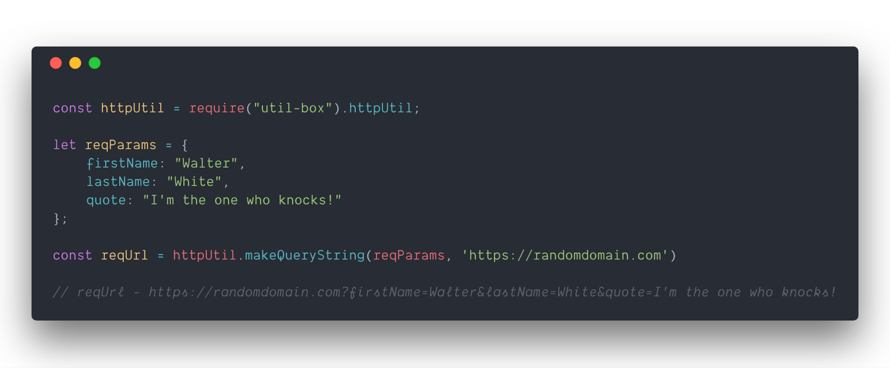
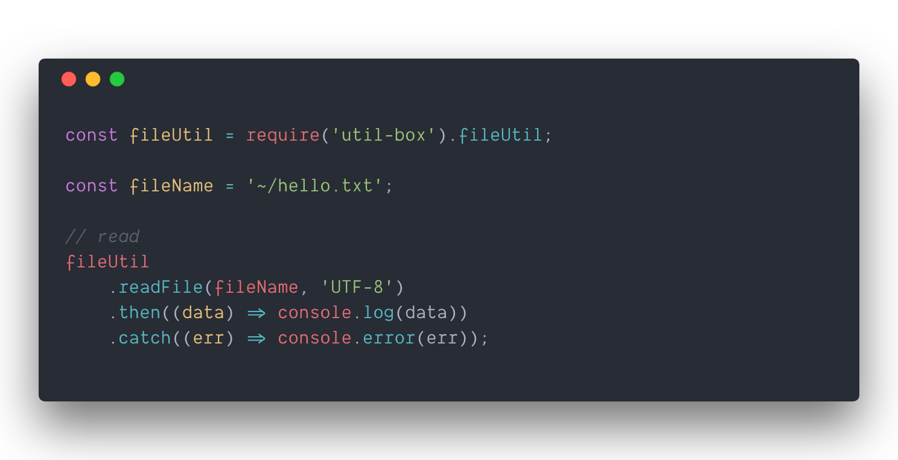

[](https://travis-ci.org/Shriram-Balaji/util-box)


>  A minimal toolbox of helper methods

## Usage

### Add util-box to your project

```console
$ npm install --save util-box
```

### HTTP Handling

 Minimal utility methods for HTTP Requests and Responses.



### Output Handling

Methods for color-coded logging.


### StopClock

Methods for logging how long an operation runs for.


### File Handling

Methods for basic file reading, writing, deleting, truncating



## Documentation

### `httpUtil.removeTrailingSlash(url)`

Removes a trailing slash from the end of a url, if present.

### `httpUtil.makeQueryString(reqParams)`

Converts request parameters into a queryString. The input `reqParams` is an object with key-value pairs of each query parameter and their corresponding values.

### `httpUtil.handleApiResponse(response)`

This handles a generic Api Response from different request libraries by returning a Promise. Additionally, it also rejects with an error for `non-2xx` responses.

### `outputUtil.success(message)`

Logs the specified message to stdout in chalk green.:

### `outputUtil.error(message)`

Logs the specied message to stdout as an error in chalk red.

### `outputUtil.debug(message)`

Logs the specified message to stdout in chalk grey, only if the `DEBUG` variable is set in `process.env`

### `fileUtil.readFile(fileName, type)`

*type (optional) denotes char-set, default="UTF-8"*

Read from an existing file. Returns a promise resolved with the data read from the file.

### `fileUtil.writeFile(fileName, data)`

Create/write to a file. Returns a promise with the fileName after successfully writing to file.

### `fileUtil.truncateFile(fileName)`

Truncates / Empties the contents of a file

### `fileUtil.deleteFile(fileName)`

Deletes the specified file